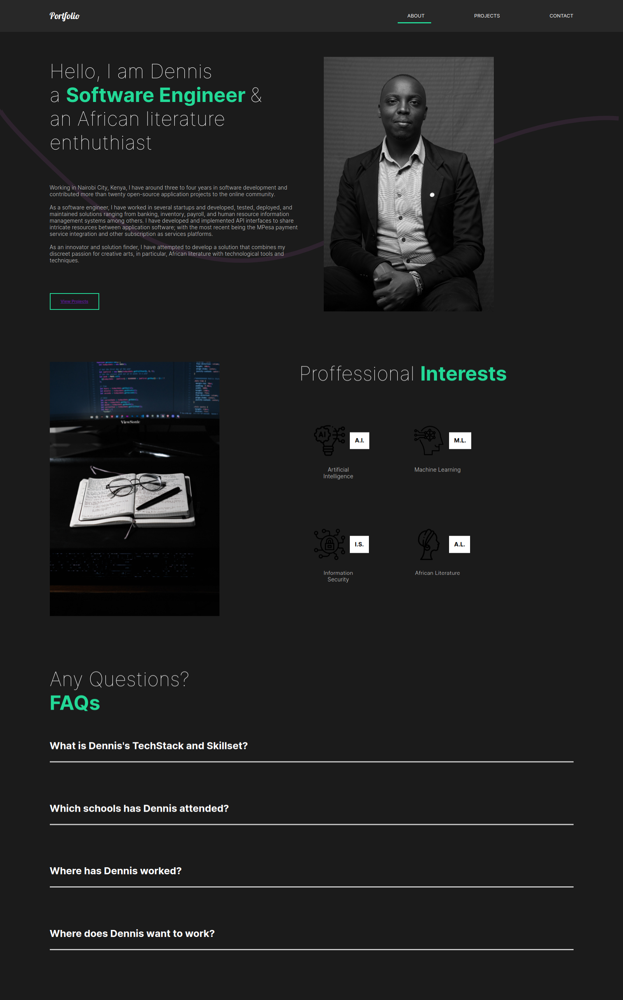

# Dennis Njenga Portfolio Website

### Description
A portfolio web application made in React JS to display my qualifications, skills, education and experience among many other attributes that make me a Software Engineer.

## Contact Me

### LinkedIn
    https://www.linkedin.com/in/deepeters/
### Github
    https://github.com/deepeters
### Email
    Dennis Njenga on Gmail: dpnjenga@gmail.com

### LICENSE: [MIT LICENSE](https://raw.githubusercontent.com/deepeters/dennis.github.io/master/LICENSE)

